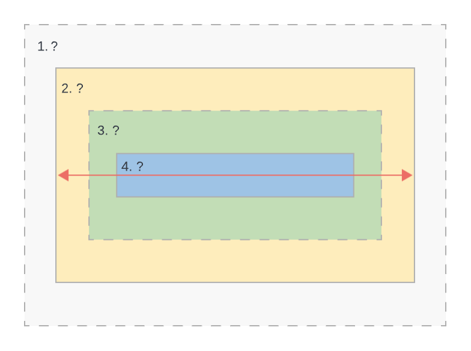

# JavaScript, Important JS for React

# REMINDER: You must record your screen as well with this prompt on the foreground.

[Here is the link for the survey to be completed after.](https://forms.office.com/r/2ty04ksdbs)

# Prompt 1

1. What is HTML?

2. What's the minimum requirements for a HTML file? Explain what each element is for

3. What is an inline vs block element? Give some examples

4. What can you tell me about CSS? How is CSS applied?

5. What's the image below? Fill in the ?'s



# Prompt 2

1. What is JavaScript?

2. What are the primitives in JavaScript?

3. What is Destructuring in JavaScript? What can it be used with? Why is it important?

4. Does JavaScript have anything to parse JSON? Does it need it?

5. What is the DOM? How do we manipulate it?

# Prompt 3

Explain the following code. Line-by-line. **_NOTE_** Answer some of the comments.

```javascript
// Explain what's happening below? What's the output?
const people = ["Adam", "Charles", "Wezley", "Richard"];
const [adam, wezley, richard] = people;

// What's going on below? What's each variables value?
const user = { username: "JesterCharles", fname: "Charles", lname: "Jester" };
const { username, firstName, lname } = user;
const updatedUser = { ...user, age: 29 };

// Explain what's happening and what the output would be...

const nums = [1, 2, 3, 4, 5];

const mult6 = (a) => {
    return a * 6;
};

const forEachRun = nums.forEach(add6); // What's the value forEachRun?
const mapRun = nums.map(add6); // What's the value for mapRun?

// What's going on here???

const functionalFun = nums
    .map(mult6) // What type of function is map? What about mult6 in this context?
    .filter((a) => a % 2 == 0)
    .map((i) => i - 6)
    .reduce((a, b) => a + b);

/*
Answer the following 3 questions:
1. Will it run?
2. If so, What's the output?
3. How could you improve it?
*/

hoistAway();

function hoistAway() {
    console.log(hello);

    var bye;
    var hello = "Hello there";

    console.log(hello);
}
```

# Explain the HTML

```html
<div id="nav"></div>

<button onclick="showTest()">Show Test</button>
<button onclick="findAll()">Show All Members</button>
<table class="member">
    <thead class="member">
        <tr class="member">
            <th>Member ID</th>
            <th>Full Name</th>
            <th>Email</th>
            <th>Experience in Months</th>
        </tr>
    </thead>
    <tbody id="memberTable" class="member"></tbody>
</table>
```

# Explain briefly how the CSS affects the above tag

```css
button {
    color: rgb(220, 57, 76);
    background-color: rgb(29, 28, 28);
    font-size: 32px;
}

#nav {
    font-size: 42px;
    border: 2px solid black;
    padding: 8px;
}

.member {
    padding: 2px;
    border: 3px solid red;
    color: red;
}
```
