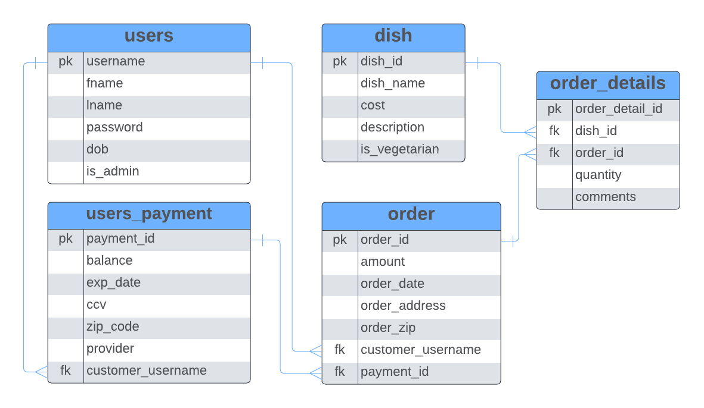

# **Project 1:** My Restaurant Application - **_DUE: 08/26/22_**

## Description

My Restaurant app was developed for a small restaurant that is looking to help streamline the ordering process for customers to help reduce costs. Customers can enjoy an seemless means to order directly with an account of their own at the restaurant in question, where Admins are capable of adding and updating the menu items. This RESTful application leverages an embedded tomcat server to handle incoming requests to thoroughly tested services that must be persisted using Hibernate and AWS PostgreSQL services.

# ERD

# User Stories

## As A: Admin

-   [ ] Create/Update/Delete a dish

## As A: Customer

-   [ ] View all dishes at the restaurant without needing to Register or Login
-   [ ] Register/Update/Delete an account
-   [ ] Add/Update/Delete my payment info
-   [ ] Create/Update an order only if Registered & Logged in
-   [ ] Once I order, balance is removed based on the amount in the order
-   [ ] Add any comments for substitutions to the order details
-   [ ] View all past orders

## Optional User Stories:

-   [ ] Re-Order a previous order
-   [ ] Favorite an order or dish
-   [ ] Can apply a coupon for discount

## Required Challenge:

In this project, you're presented with the challenge to learn and implement the use of Hibernate an ORM for java. Below are resources to help with understanding how to incorporate hibernate in your project. Please talk with your partner and research as soon as possible. Make sure to ask questions and use any resources you can. (Also check the batch project repo for some examples of implementation)

-   [What is an ORM and Why You Should Use It](https://blog.bitsrc.io/what-is-an-orm-and-why-you-should-use-it-b2b6f75f5e2a)

-   [Hibernate Documentation](https://hibernate.org/orm/documentation/5.4/)

-   [JPA and Hibernate](https://www.baeldung.com/jpql-hql-criteria-query)

-   [Tutorialspoint Hibernate](https://www.tutorialspoint.com/hibernate/index.htm)

-   [Hibernate Session Factory](https://www.java2novice.com/hibernate/session-factory/)

-   Many-to-Many: 
    -  [Example 1](https://www.codejava.net/frameworks/hibernate/hibernate-many-to-many-association-with-extra-columns-in-join-table-example)
    -  [Example 2](https://mkyong.com/hibernate/hibernate-many-to-many-example-join-table-extra-column-annotation/)
    -  [Example 3](https://stackoverflow.com/questions/5127129/mapping-many-to-many-association-table-with-extra-columns)

## Optional Challenges:

-   [ ] Utilization of JWT for user authentication
-   [ ] Session-based caching to minimize calls to the database for already retrieved data

## Tech Stack

-   [ ] Java 8
-   [ ] JUnit
-   [ ] Mockito
-   [ ] Apache Maven
-   [ ] Hibernate
-   [ ] Jackson library (for JSON marshalling/unmarshalling)
-   [ ] Java EE Servlet API (v4.0+)
-   [ ] AWS RDS - PostgreSQL
-   [ ] Git SCM (on GitHub)
-   [ ] AWS Elastic Beanstalk (Potentially)

## Functional Requirements

-   [ ] CRUD operations are supported for one or more domain objects via the web application's exposed endpoints
-   [ ] JDBC logic is abstracted away by hibernate
-   [ ] Programmatic persistence of entities (basic CRUD support) using hibernate

## Non-Functional Requirements

-   [ ] Daily Commits to Github
-   [ ] Branching strategies implemented
-   [ ] 80% line coverage of all service layer classes
-   [ ] Mocking for unit testing
-   [ ] **_RECOMMENDATION!_** Use Trello or some kanban board to keep track of target goals. You can include your trainer on these.

## Init Instructions

-   Create a new repostory within this organization for your API with the `nameOfRestaurant_API_teamMemberInitials`
-   A README.md file in your repo describing:
    -   the goal of this wedding planner
    -   how to use it(the url endpoint calls)
    -   technologies used (with versions)
    -   ERD,
    -   how to initialize it
    -   features and contributers
        -   Optional: Include potential future goals of the project

## Presentation

-   Finalized version of the web application must be pushed to personal repository within this organization by the presentation date (August 26th, 2022)
-   You'll have 10 minute for a slide deck and live demonstration of your Restaurant API leveraging Postman to hit all endpoint calls.
